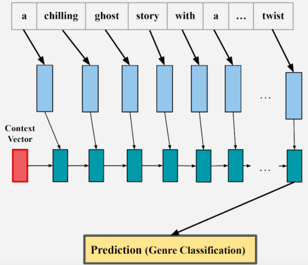
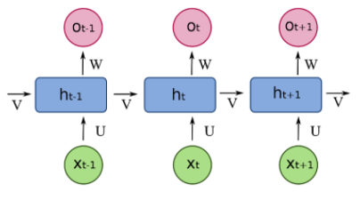
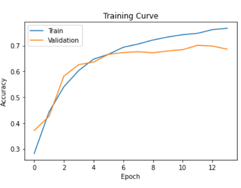

# Genre Classifier
A machine learning model to predict novel genres based on the back of book description. 

## Motivation
English is a very ambigious language. Fiction books deal with many different abstract ideas and when english is used in conjunction with literary terms it is often hard to extract a clear message from a paragraph without ample context. This project attempts to determine the connections between English vocabulary and an associated novel genre. 

Five genres were chosen based upon their popularity:
- Romance
- Mystery
- Fantasy
- Horror
- Science-Fiction

When humans were asked to perform the task of classifying novel genres based on the back of book description there was a 71.8% success rate. Horror was misclassified the most frequently with an error rate of 56%.

## Data Collection
### Sources
Book data collected from:
- Google Books
- Goodreads
- OpenLibrary
### Data
Pieces of data needed from each book:
- Title
- Author
- Description
- Genre
### Data Cleaning
Removed from description:
- Title
- Author
- Non ASCII-128 characters
- Non alphabetical characters
- All Punctuation
- "New York Times" or "Bestseller"
- ISBN

## Model
### Architecture
An RNN (Recurrent Neural Network) was chosen due to the language related learning task. GloVe Embeddings were employed to encode the description into word-level tensors. 

     
    <em>Figure 1: Word Embeddings</em>  
     
    <em>Figure 2: RNN</em>

### Training
Optimized hyperparameters:
- Input Dimension: 200
- Batch Size: 10
- Learning Rate: 0.0001
- Hidden Layers: 1
    - Hidden Units: 50
- Epochs: 45
- Optimizer: adam
- GRU
- Dropout: 
    - Input Layer: 0.2
    - Training Layers: 0.5

## Results
Training Accuracy: 76.7%

Validation Accuracy: 68.6%

**Test Accuracy: 71.1%**

     
    <em>Figure 3: Final Training Curve</em>

Our final test accuracy of 71.1% is comparable to the human accuracy of 71.8%. This indicates that our model achieved near human-like performance. 

## Next Steps
This project can be augmented by collecting more data to train our model. Furthermore, additional data cleaning to remove non-essential information from the book descriptions would increase the accuracy. Adding more Dropout or GRU layers may mitigate the overfitting that occurs as we train for more epochs. Adding max pooling outputs may allow the model to train faster as well.

An extention to this project is to attempt something similar and create a model to classify novel genres based on the title of the book. This would be much more challenging since there are far fewer words in the title. 

